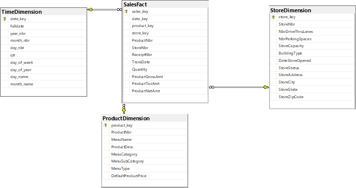
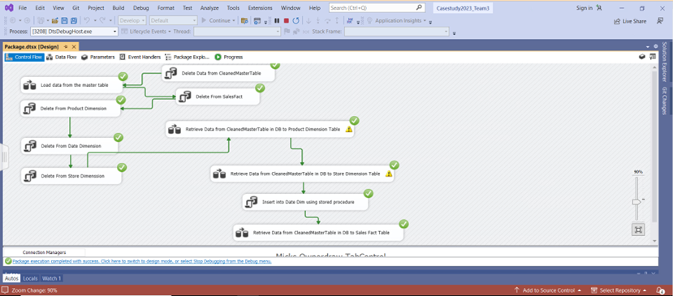
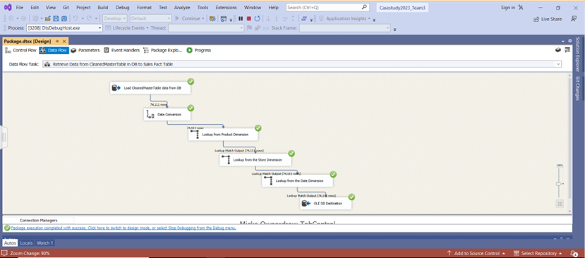

## ETL Analysis for Lettuce Feed U Restaurant Chain

### Tools Used
- SQL Server Integration Services (SSIS)
- Microsoft Visual Studio


## Introduction:
Lettuce Feed U is a restaurant chain that belongs to Health Options, Inc., a company that has been in business for 20 years and has various establishments located in different parts of the United States. Each restaurant offers one or more drive-thru lanes for customer convenience, and all of them offer the same menu items at identical prices.

## Project Objectives:
- To clean the dataset CaseStudy2023_New and create a master cleaned dataset. 
-	Define, create, and populate the fact and dimension tables using SSIM and Microsoft Visual Studio.
- Provide accurate and reliable insights to the executive team based on our ETL analysis.


## Data Diagram


## Data Analysis:
1.	Data Access & Preparation – 
The first step was to create a master table in our own database and insert data from the CaseStudy2023 dataset provided to us. This data had some inconsistencies like null values, the number zero in the description column, and some invalid characters. This portion was executed in SSIM.

```
DROP TABLE if exists [CaseStudy2023_new]
go

SELECT *
INTO SP23_kschrane.dbo.CaseStudy2023_new
FROM CaseStudy2023.dbo.CaseStudy2023AllRecs_new
GO

select * from CaseStudy2023_new

```

## Data Cleaning & Transformation
This process is executed in Visual Studio.
1.	Remove the duplicates- We used the ‘Sort’ tool and checked the ‘remove duplicates’ checkbox
2.	Replace weird values -  I used ‘Derived Columns’ to replace the following:
  -	BuildingType - Replace NULL value to “NONE”
  -	StoreAddress - Replace comma “,” to “”
  -	ProductDescr column
  - Replace “?” to “”
  - Replace “,” to “+” (I chose to output a csv file. Because comma is the delimited in the flat file destination, extra commas in ProductDescr string would produce extra columns in the destination file)
  -	Replace “0” to “None”
  -	MenuSubCategory – Replace “0” to “None”
    
3.	Change data type when loading data to the OLE DB Destination
-	ReceiptNbr, StoreNbr, ProductNbr use 4 bytes unsigned integer
-	ProductGrossAmt, ProductNetAmt, ProductTaxAmt use float data type
-	BuildingType use string(200)
-	TransDate, DateStoreOpened use date data type
-	TransTime use database time
-	StoreStatus use string(50)
-	StoreAddress, StoreCity, StoreState use string(200)
-	StoreZipCode use string(10)
-	MenuName use string(10)
-	ProductDesc use string(300), MenuCategory, MenuSubCategory, MenuType use string(200)
-	DefaultProductPrice use float
-	Remove the column File1ID

4.	By the end of this process, we have two datasets – one is the original before cleaning and the newer version after cleaning named CleanedMasterTable.



